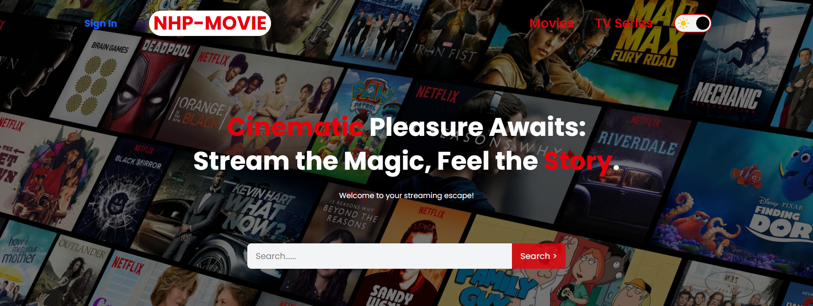
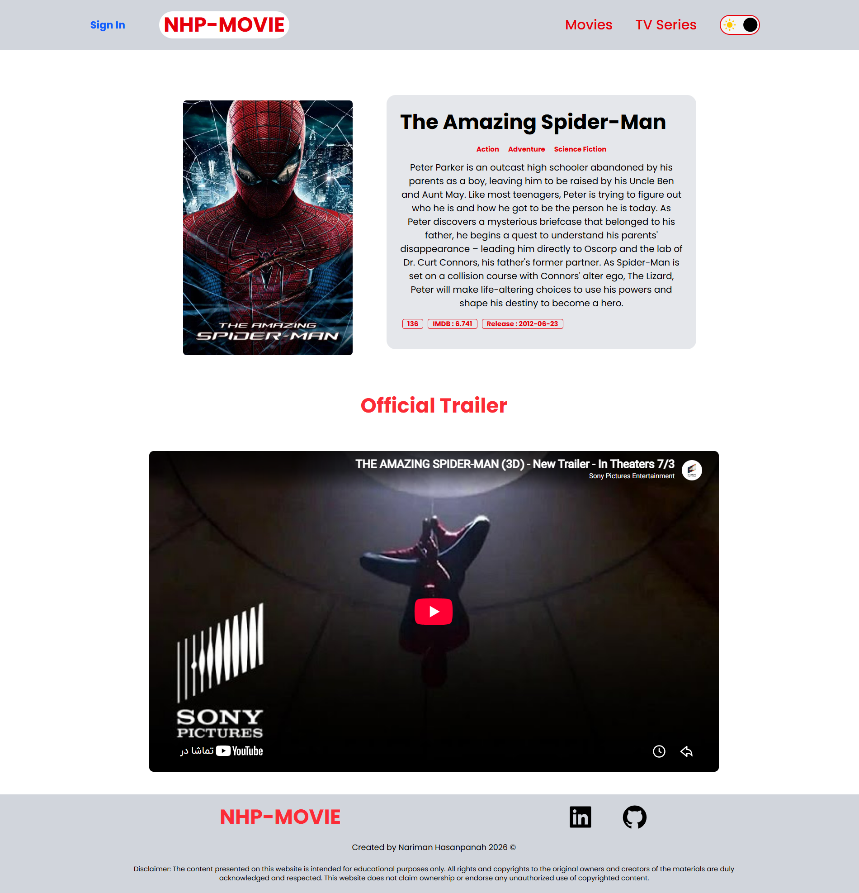

# 🎬 Movie App

A modern React-based movie discovery app powered by the TMDB API  
Browse trending movies, TV series, and watch official trailers in a beautiful UI.

---

---

## ⚡ Tech Stack

- ⚛️ React (Vite)
- 🎨 Tailwind CSS
- 🔀 React Router
- 📡 Axios
- 🧠 Context API
- 🎬 TMDB API

---

## ✨ Features

- 🔥 Trending Movies & TV Series
- 🔍 Search functionality for movies & series
- 🎞️ Watch official trailers (YouTube embed)
- 📄 Detailed movie & series pages
- 📱 Fully responsive design (mobile-first)
- ⚡ Fast performance with Vite
- 🧭 Clean routing with React Router

---

## 📸 Preview

### Home Page Light Mode

### Home Page Dark Mode

### Details Page

### Search Page

---

## 🚀 Live Demo

👉 [View Live Project](https://nhp-movie-app.netlify.app/)

---

## ⚙️ Installation

git clone https://github.com/Nariman-Hasanpanah/movie-app.git
cd movie-app
npm install
npm run dev

---

## 🔑 Environment Variables

Create a .env file in root:

## VITE_TMDB_API_KEY=your_api_key_here

## 📁 Folder Structure

src/
├── components/
├── pages/
├── context/
├── assets/
├── App.jsx
└── main.jsx

---

## 📚 What I Learned

- Working with REST APIs
- Managing global state using Context API
- Building reusable components
- React Router navigation
- Handling async data fetching
- UI responsiveness with Tailwind
- Real-world project structuring

---

## 👨‍💻 Author

Nariman Hasanpanah

- GitHub: https://github.com/Nariman-Hasanpanah
- LinkedIn: https://www.linkedin.com/in/nariman-hasan-panah-7b1897308

---

## ⭐ Support

If you like this project, don't forget to give it a ⭐ on GitHub, thank you!
